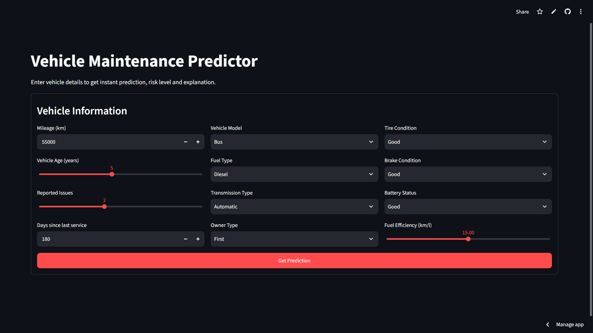
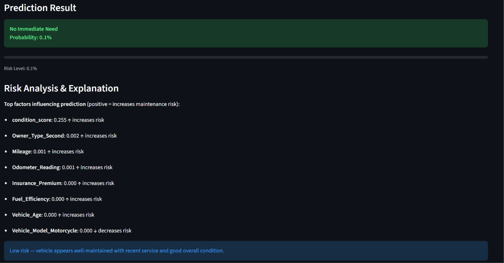

# Predictive Vehicle Maintenance 🚗

> A machine-learning application that predicts whether a vehicle is likely to require maintenance and presents an interpretable prediction through a Streamlit interface.

[](https://predictive-vehicle-maintenance.streamlit.app/)
[](https://www.python.org/)
[](LICENSE)

**Live Demo:**  
https://predictive-vehicle-maintenance.streamlit.app/

---

## Application Preview

### Prediction Interface



The Streamlit interface accepts vehicle information such as mileage, vehicle model, age, fuel type, transmission, reported issues, service history, and condition indicators.

### Prediction & Explanation



The application presents the predicted maintenance risk together with an interpretable breakdown of factors influencing the result.

---

## Overview

Predictive Vehicle Maintenance is a machine-learning demonstration for estimating whether a vehicle is likely to require maintenance based on vehicle characteristics, operating information, service history, and condition-related features.

The project combines:

- Feature engineering
- Exploratory data analysis
- Multiple machine-learning models
- Stratified train/test evaluation
- Feature scaling
- Model inference
- SHAP-based explanation support
- Streamlit-based interactive prediction

The project is structured so that data preparation, preprocessing, inference, and explanation logic are separated into reusable modules.

---

## Key Features

### 🚗 Vehicle Maintenance Prediction

The application accepts vehicle information including:

- Mileage
- Vehicle model
- Vehicle age
- Fuel type
- Transmission type
- Tire condition
- Brake condition
- Battery status
- Fuel efficiency
- Reported issues
- Days since last service
- Owner type

The submitted information is processed through the trained machine-learning pipeline to generate a maintenance prediction.

---

### 📊 Model Comparison

The training pipeline compares multiple machine-learning approaches, including:

- XGBoost
- LightGBM
- Random Forest

Models are evaluated using:

- ROC-AUC
- Precision
- Recall
- F1 score

The evaluation uses a stratified train/test split.

---

### 🧩 Feature Engineering

The preprocessing pipeline includes:

- Date-derived service features
- Numeric feature processing
- Ordinal feature encoding
- One-hot encoding for categorical variables
- Feature scaling
- Consistent feature ordering between training and inference

The selected feature configuration is stored with the project so that inference can reproduce the expected model input structure.

---

### 🔍 Interpretable Predictions

The application provides explanation information alongside the prediction.

SHAP-based explanation support is used to identify factors that contribute to the predicted maintenance risk.

The interface distinguishes between factors that increase and decrease the predicted risk.

---

### 📈 Exploratory Data Analysis

The project includes generated visualizations for exploring the dataset and target relationship.

Included analysis covers:

- Target distribution
- Key-feature distributions
- Feature correlations
- Condition score versus target
- Feature boxplots

EDA outputs are stored in the repository for reproducibility and reference.

---

### 🧪 Automated Testing

The project includes automated tests for important parts of the application and preprocessing pipeline.

Tests cover areas such as:

- Input validation
- Prediction helpers
- Feature handling
- Model-related utilities

Run the test suite with:

```bash
pytest -q
